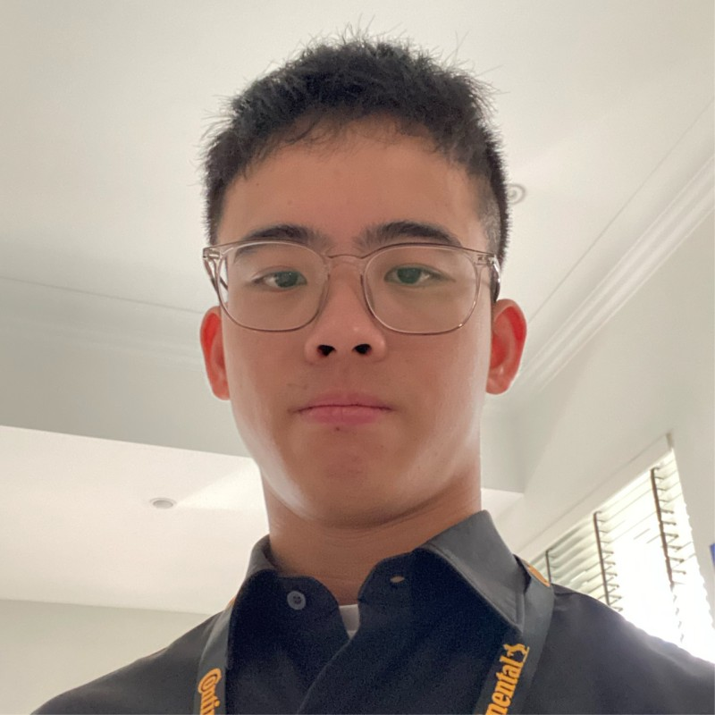
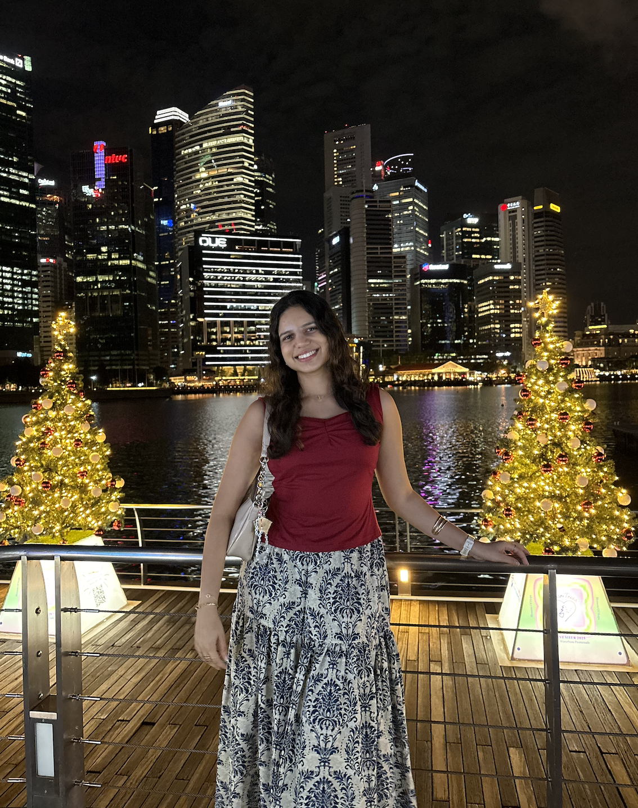
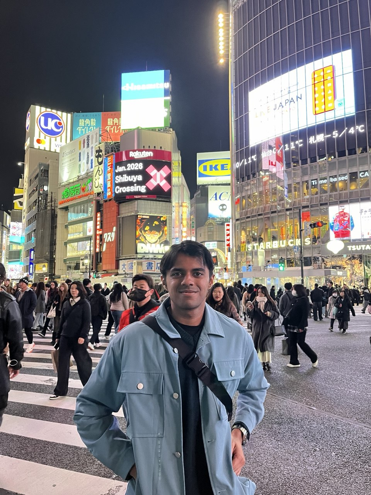

We are a team based in the [School of Computing, National University of Singapore](https://www.comp.nus.edu.sg).

You can reach us at the email `seer[at]comp.nus.edu.sg`

## Project team

### Chang Jia Jun

* Role: Documentation

[[github](https://github.com/jiajunchang2002g)]

### Ashwika Gupta

[[homepage](ashwacka.github.io)]
[[github](https://github.com/ashwacka)]
[[portfolio](team/johndoe.md)]

* Role: Scheduling and Tracking

### Isaac Chen

[[homepage](https://Iscaraca.github.io)]
[[github](https://github.com/Iscaraca)]

* Role: Team Lead
* Responsibilities: Testing + Github workflow integration

### Harikrishnan

[[github](https://github.com/harikrishnannandakumar)]
[[portfolio](team/harikrishnan.md)]

* Role: Developer
* Responsibilities: Testing + Documentation

### Jean Doe

[[github](http://github.com/johndoe)]
[[portfolio](team/johndoe.md)]

* Role: Developer
* Responsibilities: Dev Ops + Threading

### James Doe

[[github](http://github.com/johndoe)]
[[portfolio](team/johndoe.md)]

* Role: Developer
* Responsibilities: UI
