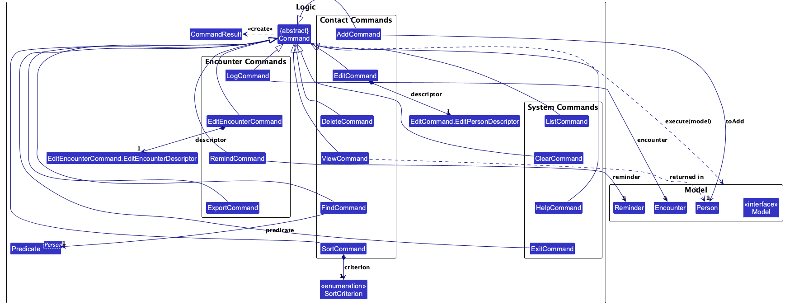
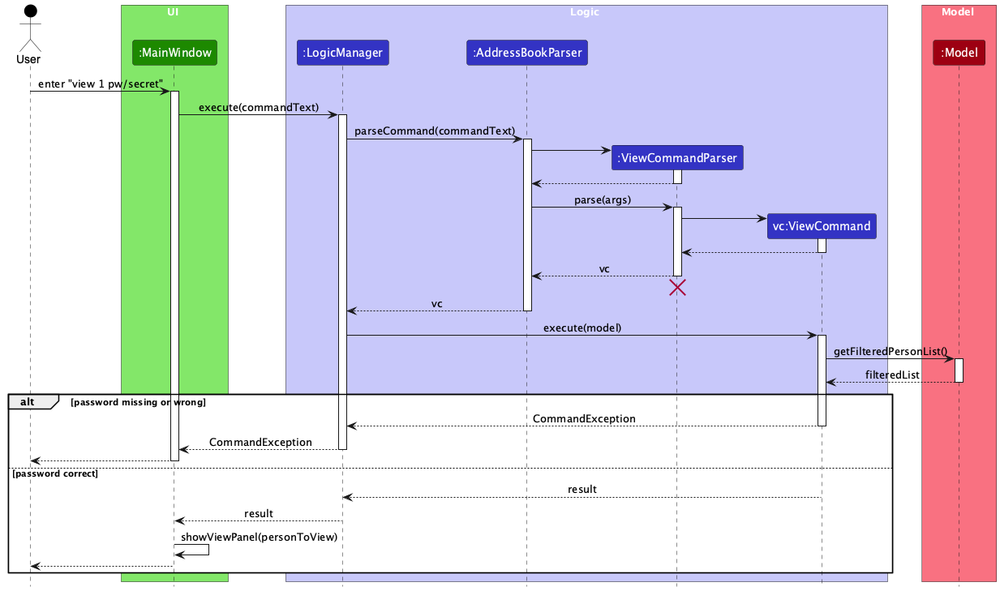
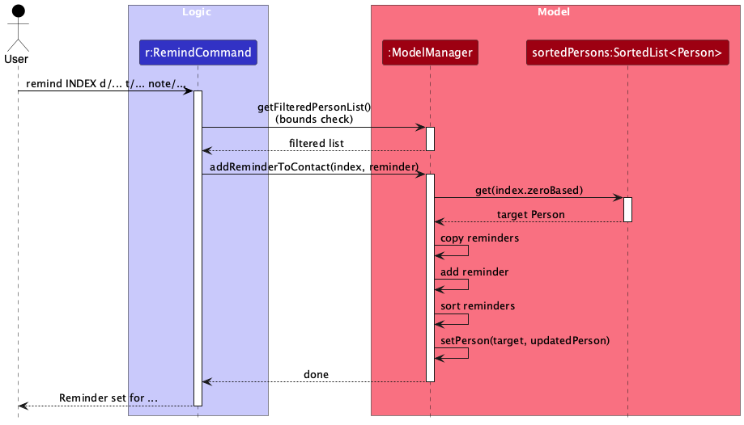
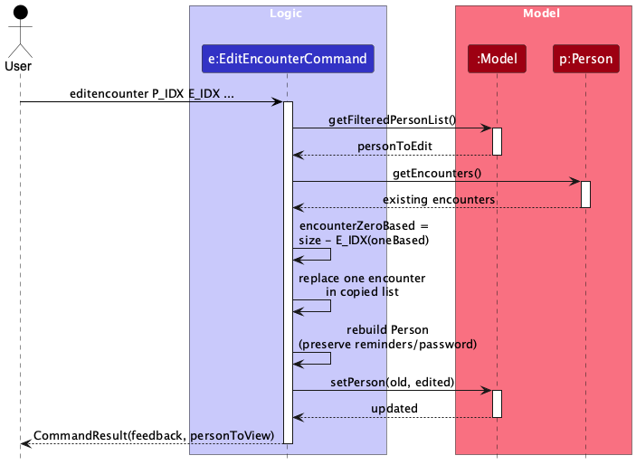

* Table of Contents
{:toc}

--------------------------------------------------------------------------------------------------------------------

## **Acknowledgements**

AI tools such as Claude, ChatGPT was used to support:
- Drafting and refining documentation (Developer Guide and User Guide)
- Generating and improving test case structures
- Suggesting code refactoring and design clarifications
- All AI-generated content was reviewed, validated, and adapted by the development team to ensure correctness and alignment with project requirements.

--------------------------------------------------------------------------------------------------------------------

## **Setting up, getting started**

Refer to [_Setting up and getting started_](SettingUp.md).

--------------------------------------------------------------------------------------------------------------------

## **Design**

### Architecture


CrimeWatch follows a layered architecture with five main parts:
* `UI`: renders data and captures user input.
* `Logic`: parses and executes commands.
* `Model`: stores in-memory domain state.
* `Storage`: persists and loads data.
* `Commons`: shared helpers (`logs`, `config`, utility classes).

`MainApp` initializes `Storage`, `Model`, `Logic`, and `UI` in this order, and wires dependencies through interfaces.

At runtime, a typical command follows this high-level flow:
1. User enters a command in `UI`.
2. `Logic` parses the input into a concrete `Command`.
3. `Command` updates or queries `Model`.
4. `LogicManager` triggers persistence through `Storage`.
5. `UI` refreshes based on observable lists and command result feedback.

#### High-level runtime sequence


The diagram above summarizes the end-to-end interaction across `UI`, `Logic`, `Model`, and `Storage` for a typical command execution.


---

### UI component

#### API

[`Ui.java`](../src/main/java/seedu/address/ui/Ui.java)


The UI is JavaFX-based and centered around `MainWindow`, which composes:
* `CommandBox` for command input.
* `ResultDisplay` for feedback messages.
* `PersonListPanel` for list rendering.
* `ViewPanel` for full contact profile details.
* `StatusBarFooter` for save path/status.
* `HelpWindow` for help content.

`UiManager` owns startup concerns (main stage setup, icon setup, fatal dialog handling), while `MainWindow` handles most user interaction wiring.

Design notes:
* `MainWindow` receives a `Logic` reference and executes commands through `logic.execute(...)`.
* `PersonListPanel` is bound to `logic.getFilteredPersonList()`.
* `CommandResult` flags (`showHelp`, `exit`, `personToView`) drive post-command UI behavior.

---

### Logic component

#### API

[`Logic.java`](../src/main/java/seedu/address/logic/Logic.java)

.

The diagram above treats concrete command types as `XYZCommand` to keep the high-level view compact.
The following class diagram zooms into that placeholder and shows the concrete command hierarchy, together
with key command-specific collaborators and multiplicities:



The sequence diagram below illustrates the interactions within the `Logic` component, taking `execute("delete 1")` API call as an example.


<div markdown="span" class="alert alert-info">:information_source: **Note:** The lifeline for `DeleteCommandParser` should end at the destroy marker (X) but due to a limitation of PlantUML, the lifeline continues till the end of diagram.
</div>

The `Logic` component processes command text in this pipeline:
1. `LogicManager.execute(String)` receives raw input.
2. `AddressBookParser` determines command word and delegates to command-specific parser.
3. A concrete `Command` object is created and executed on `Model`.
4. `CommandResult` is returned to `UI`.
5. `LogicManager` persists state by calling `storage.saveAddressBook(...)`.


Parser design:
* Command parsers implement the common `Parser<T>` interface.
* Prefix-based commands use `ArgumentTokenizer` and `ArgumentMultimap`.
* Validation and conversion are centralized in `ParserUtil`.
* Duplicate-prefix validation is handled by `verifyNoDuplicatePrefixesFor(...)`.

---

### Model component

#### API

[`Model.java`](../src/main/java/seedu/address/model/Model.java)

.

`ModelManager` stores in-memory app state:
* `AddressBook` for canonical contact data.
* `UserPrefs` for application preferences.
* `FilteredList<Person>` + `SortedList<Person>` for UI-facing views.

Core domain type: `Person`, extended for CrimeWatch with:
* identity/contact fields (`Name`, `Phone`, `Email`, `Address`)
* investigation fields (`Stage`, `Risk`, `Alias`, `Notes`)
* collections (`Tag`, `Encounter`, `Reminder`)
* optional `Password` for feature-level access control

Design notes:
* identity uniqueness is enforced through `UniquePersonList` and `Person#isSamePerson`.
* sorting is view-level (via comparator on `SortedList`) and does not reorder persisted storage sequence.
* reminder entries are maintained in chronological order when added.

---

### Storage component

#### API

[`Storage.java`](../src/main/java/seedu/address/storage/Storage.java)


Storage uses JSON persistence:
* `StorageManager` coordinates address book and preferences storage.
* `JsonAddressBookStorage` reads/writes contact data.
* `JsonUserPrefsStorage` reads/writes GUI/user preferences.
* `JsonSerializableAddressBook` + `JsonAdaptedPerson` bridge model objects and JSON schema.

Error behavior:
* Read/load errors surface to startup logic.
* Save errors during command execution are wrapped as user-visible `CommandException`s in `LogicManager`.

---

### Common classes

The `seedu.address.commons` package contains shared utilities:
* `LogsCenter` and logger setup.
* `GuiSettings` and config helpers.
* value/helper utilities (`StringUtil`, `ToStringBuilder`, etc.).

--------------------------------------------------------------------------------------------------------------------

## **Implementation**

This section documents key implementation decisions for major CrimeWatch features.

### Add command

#### Overview

`add` creates a new `Person` with required and optional fields:
* required: `n/`, `p/`, `e/`, `a/`, `s/`
* optional: `al/`, `note/`, `r/`, `pw/`, `t/`

#### Command format

The current `add` command format is:

`add n/NAME p/PHONE e/EMAIL a/ADDRESS s/STAGE [al/ALIAS(,ALIAS...)] [note/NOTES] [r/RISK] [pw/PASSWORD] [t/TAG]...`

Required fields:
- `n/` name
- `p/` phone
- `e/` email
- `a/` address
- `s/` stage

Optional fields:
- `al/` aliases (comma-separated)
- `note/` notes
- `r/` risk (defaults to `medium`)
- `pw/` password (contact-level protection)
- `t/` tags (repeatable)

#### Parsing flow

`AddCommandParser`:
* tokenizes input by supported prefixes.
* validates required prefixes and preamble constraints.
* rejects duplicate single-value prefixes.
* parses fields through `ParserUtil` and constructs `Person`.

`AddCommand#execute(Model)`:
* checks duplicate identity via `model.hasPerson(toAdd)`.
* inserts via `model.addPerson(toAdd)`.

Key parser behavior:
- Rejects missing required prefixes with `MESSAGE_INVALID_COMMAND_FORMAT`.
- Uses `verifyNoDuplicatePrefixesFor(...)` for `n/`, `p/`, `e/`, `a/`, `al/`, `note/`, `r/`, `pw/`, `s/`.
- Parses aliases via `ParserUtil.parseAliases(...)`; empty alias payload is rejected.
- Applies default risk via `Risk.getDefault()` when `r/` is omitted.
- Parses tags from all `t/` occurrences into a `Set<Tag>`.

#### Field constraints

Validation is enforced in model/value objects and parser utilities:
- `Name`: alphanumeric + spaces, non-blank.
- `Phone`: digits only, at least 3 digits.
- `Email`: must satisfy email format constraints.
- `Address`: non-blank.
- `Alias`: trimmed, 1-50 chars, alphanumeric + spaces.
- `Stage`: one of `surveillance`, `approached`, `cooperating`, `arrested`, `closed`.
- `Notes`: optional text, max 500 chars, no newlines.
- `Risk`: one of `low`, `medium`, `high` (case-insensitive parser).
- `Password`: alphanumeric + spaces, non-blank when provided.
- `Tag`: alphanumeric.

Relevant classes:
- [`src/main/java/seedu/address/logic/parser/ParserUtil.java`](../src/main/java/seedu/address/logic/parser/ParserUtil.java)
- [`src/main/java/seedu/address/model/person/Name.java`](../src/main/java/seedu/address/model/person/Name.java)
- [`src/main/java/seedu/address/model/person/Phone.java`](../src/main/java/seedu/address/model/person/Phone.java)
- [`src/main/java/seedu/address/model/person/Email.java`](../src/main/java/seedu/address/model/person/Email.java)
- [`src/main/java/seedu/address/model/person/Address.java`](../src/main/java/seedu/address/model/person/Address.java)
- [`src/main/java/seedu/address/model/person/Alias.java`](../src/main/java/seedu/address/model/person/Alias.java)
- [`src/main/java/seedu/address/model/person/Stage.java`](../src/main/java/seedu/address/model/person/Stage.java)
- [`src/main/java/seedu/address/model/person/Notes.java`](../src/main/java/seedu/address/model/person/Notes.java)
- [`src/main/java/seedu/address/model/person/Risk.java`](../src/main/java/seedu/address/model/person/Risk.java)
- [`src/main/java/seedu/address/model/person/Password.java`](../src/main/java/seedu/address/model/person/Password.java)
- [`src/main/java/seedu/address/model/tag/Tag.java`](../src/main/java/seedu/address/model/tag/Tag.java)

### Sort feature

#### Overview

The `sort` feature reorders the currently displayed contact list by a selected criterion:
- `location`
- `tag`
- `alphabetical`
- `status`
- `recent`

This is implemented as a **view-level sort**. It does not mutate persisted `AddressBook` ordering in storage.

#### Command flow

1. User enters `sort CRITERION`.
2. `AddressBookParser` routes the command word `sort` to `SortCommandParser`.
3. `SortCommandParser` validates that there is exactly one token and maps it to `SortCriterion`.
4. `SortCommand#execute(Model)` calls `model.setPersonSortComparator(...)` with the criterion comparator.
5. UI updates automatically because it is bound to `Model#getFilteredPersonList()`.

Key classes:
- [`src/main/java/seedu/address/logic/parser/AddressBookParser.java`](../src/main/java/seedu/address/logic/parser/AddressBookParser.java)
- [`src/main/java/seedu/address/logic/parser/SortCommandParser.java`](../src/main/java/seedu/address/logic/parser/SortCommandParser.java)
- [`src/main/java/seedu/address/logic/commands/SortCommand.java`](../src/main/java/seedu/address/logic/commands/SortCommand.java)

#### Model integration

Sorting support is added to the `Model` API:
- `setPersonSortComparator(Comparator<Person>)`
- `clearPersonSortComparator()`

`ModelManager` now keeps:
- `FilteredList<Person> filteredPersons` for filtering
- `SortedList<Person> sortedPersons` wrapping `filteredPersons` for sorting

`getFilteredPersonList()` returns `sortedPersons`, so existing UI wiring works without extra UI changes.

Key classes:
- [`src/main/java/seedu/address/model/Model.java`](../src/main/java/seedu/address/model/Model.java)
- [`src/main/java/seedu/address/model/ModelManager.java`](../src/main/java/seedu/address/model/ModelManager.java)

#### Comparator behavior

Implemented in `SortCommand.SortCriterion`:
- `alphabetical`: by `Person#getName()`
- `status`: by `Person#getStage().toString()`, then by name
- `tag`: by alphabetically smallest tag name, nulls last, then by name
- `location`: by latest encounter location, normalized (trim + collapse spaces), nulls last, then by name
- `recent`: by latest encounter datetime descending (most recent first), then by name

For contacts with missing values (e.g., no encounters/no tags), comparators use `nullsLast(...)` so they appear at the end for those criteria.

#### Defensive parsing and validation

`SortCommandParser` rejects:
- missing criterion
- multiple tokens
- unsupported criterion

All invalid forms throw `ParseException` with `MESSAGE_INVALID_COMMAND_FORMAT` and command usage.

#### Tests

Parser tests:
- [`src/test/java/seedu/address/logic/parser/SortCommandParserTest.java`](../src/test/java/seedu/address/logic/parser/SortCommandParserTest.java)
- registration coverage in [`src/test/java/seedu/address/logic/parser/AddressBookParserTest.java`](../src/test/java/seedu/address/logic/parser/AddressBookParserTest.java)

Command/model integration tests:
- [`src/test/java/seedu/address/logic/commands/SortCommandTest.java`](../src/test/java/seedu/address/logic/commands/SortCommandTest.java)

Compatibility updates:
- `Model` test stubs implement the new methods, e.g. in [`src/test/java/seedu/address/logic/commands/AddCommandTest.java`](../src/test/java/seedu/address/logic/commands/AddCommandTest.java)

---

### Log command

The `log` command appends a new encounter to the selected contact in the current displayed list. After validating the target index against `Model#getFilteredPersonList()`, `LogCommand#execute(Model)` copies the contact's existing encounters, appends the new `Encounter`, rebuilds the `Person`, and calls `model.setPerson(...)`.

The reconstructed `Person` preserves all unrelated fields, including reminders and password, while updating only the encounter history. The returned `CommandResult` includes the updated person so the UI can continue showing the refreshed profile.

Key classes:
- [`src/main/java/seedu/address/logic/commands/LogCommand.java`](../src/main/java/seedu/address/logic/commands/LogCommand.java)
- [`src/main/java/seedu/address/model/person/Encounter.java`](../src/main/java/seedu/address/model/person/Encounter.java)
- [`src/main/java/seedu/address/model/person/Person.java`](../src/main/java/seedu/address/model/person/Person.java)

### Export encounters to CSV

#### Overview

`export l/LOCATION` writes encounters at the specified location to:
`exports/CrimeWatch-export-<timestamp>.csv`.

#### Implementation notes

* `ExportCommandParser` validates the required `l/LOCATION` input.
* `ExportCommand` scans the canonical address book via `model.getAddressBook().getPersonList()`, so export is independent of the current filtered or sorted UI view.
* Matching is case-insensitive after trimming surrounding whitespace.
* Matching encounters are converted into CSV rows, sorted by encounter datetime, and written to `./exports/`.
* The output directory is created automatically if it does not already exist.

#### Rationale and trade-off

* CSV is easy to inspect and import into reporting tools.
* Exact location matching keeps export behavior predictable, while case-insensitive comparison remains forgiving for user input.

### Password Feature

### Overview
Optional, contact-level password protection. Each contact can be protected with a password to restrict viewing its full details.

| Feature | Description |
|---------|-------------|
| **Scope** | Per-contact (individual contacts can be protected) |
| **Type** | Optional (contacts don't require passwords) |
| **Usage** | Add `pw/PASSWORD` to `add` or `edit` commands to protect; provide it with `view` to access |
| **Validation** | Alphanumeric characters and spaces only |

### Usage

```bash
# Add contact with password protection
add n/John Doe p/98765432 e/john@example.com a/123 Main St s/surveillance pw/password123

# Update/remove password
edit 1 pw/newpassword   # Change password
edit 1 pw/              # Remove protection
```

### View protected contact
view 1 pw/password123   # Show full details if password correct
view 1                  # Error: password required

### Behavior
- **Without password**: Contact viewable normally
- **With password**: `view` command requires correct password to display full details
- **Plain text**: Passwords stored without encryption (not production-ready)

### Sequence Diagram

The following sequence diagram shows how the `view` command processes a password-protected contact:



### Remind command

The `remind` command resolves its target using the same filtered and sorted contact list currently shown to the user. This is important because `ModelManager#getFilteredPersonList()` returns `sortedPersons`, so the displayed index must be interpreted against the sorted view rather than the raw address book order.

The command first performs bounds checking against the displayed list in `RemindCommand#execute(Model)`, then delegates the actual update to `Model#addReminderToContact(Index, Reminder)`. `ModelManager` retrieves the target from `sortedPersons`, copies the existing reminder list, adds the new reminder, sorts the updated reminders chronologically, and rebuilds the `Person` before calling `setPerson(...)`.



Key classes:
- [`src/main/java/seedu/address/logic/commands/RemindCommand.java`](../src/main/java/seedu/address/logic/commands/RemindCommand.java)
- [`src/main/java/seedu/address/model/Model.java`](../src/main/java/seedu/address/model/Model.java)
- [`src/main/java/seedu/address/model/ModelManager.java`](../src/main/java/seedu/address/model/ModelManager.java)

### Edit Encounter command

The `editencounter` command uses two indices: `PERSON_INDEX` identifies the contact in the displayed contact list, while `ENCOUNTER_INDEX` refers to the encounter cards shown in `view`. The UI renders those encounter cards in reverse-chronological order, so display index `1` refers to the most recent encounter rather than the first element stored in the underlying encounter list.

To preserve that user-facing numbering, `EditEncounterCommand#execute(Model)` converts the displayed encounter index back into the stored zero-based index using `existingEncounters.size() - encounterDisplayOneBased`. It then replaces only the selected encounter in a copied list and rebuilds the `Person` with the updated encounters while preserving other fields such as reminders and password protection.



Key classes:
- [`src/main/java/seedu/address/logic/commands/EditEncounterCommand.java`](../src/main/java/seedu/address/logic/commands/EditEncounterCommand.java)
- [`src/main/java/seedu/address/ui/ViewPanel.java`](../src/main/java/seedu/address/ui/ViewPanel.java)
- [`src/main/java/seedu/address/model/person/Person.java`](../src/main/java/seedu/address/model/person/Person.java)

### \[Proposed\] Undo/redo feature

#### Proposed Implementation

The proposed undo/redo mechanism is facilitated by `VersionedAddressBook`. It extends `AddressBook` with an undo/redo history, stored internally as an `addressBookStateList` and `currentStatePointer`. Additionally, it implements the following operations:

* `VersionedAddressBook#commit()` — Saves the current address book state in its history.
* `VersionedAddressBook#undo()` — Restores the previous address book state from its history.
* `VersionedAddressBook#redo()` — Restores a previously undone address book state from its history.

These operations are exposed in the `Model` interface as `Model#commitAddressBook()`, `Model#undoAddressBook()` and `Model#redoAddressBook()` respectively.

Given below is an example usage scenario and how the undo/redo mechanism behaves at each step.

Step 1. The user launches the application for the first time. The `VersionedAddressBook` will be initialized with the initial address book state, and the `currentStatePointer` pointing to that single address book state.


Step 2. The user executes `delete 5` command to delete the 5th person in the address book. The `delete` command calls `Model#commitAddressBook()`, causing the modified state of the address book after the `delete 5` command executes to be saved in the `addressBookStateList`, and the `currentStatePointer` is shifted to the newly inserted address book state.


Step 3. The user executes `add n/David …​` to add a new person. The `add` command also calls `Model#commitAddressBook()`, causing another modified address book state to be saved into the `addressBookStateList`.


<div markdown="span" class="alert alert-info">:information_source: **Note:** If a command fails its execution, it will not call `Model#commitAddressBook()`, so the address book state will not be saved into the `addressBookStateList`.

</div>

Step 4. The user now decides that adding the person was a mistake, and decides to undo that action by executing the `undo` command. The `undo` command will call `Model#undoAddressBook()`, which will shift the `currentStatePointer` once to the left, pointing it to the previous address book state, and restores the address book to that state.


<div markdown="span" class="alert alert-info">:information_source: **Note:** If the `currentStatePointer` is at index 0, pointing to the initial AddressBook state, then there are no previous AddressBook states to restore. The `undo` command uses `Model#canUndoAddressBook()` to check if this is the case. If so, it will return an error to the user rather
than attempting to perform the undo.

</div>

The following sequence diagram shows how an undo operation goes through the `Logic` component:


<div markdown="span" class="alert alert-info">:information_source: **Note:** The lifeline for `UndoCommand` should end at the destroy marker (X) but due to a limitation of PlantUML, the lifeline reaches the end of diagram.

</div>

Similarly, how an undo operation goes through the `Model` component is shown below:


The `redo` command does the opposite — it calls `Model#redoAddressBook()`, which shifts the `currentStatePointer` once to the right, pointing to the previously undone state, and restores the address book to that state.

<div markdown="span" class="alert alert-info">:information_source: **Note:** If the `currentStatePointer` is at index `addressBookStateList.size() - 1`, pointing to the latest address book state, then there are no undone AddressBook states to restore. The `redo` command uses `Model#canRedoAddressBook()` to check if this is the case. If so, it will return an error to the user rather than attempting to perform the redo.

</div>

Step 5. The user then decides to execute the command `list`. Commands that do not modify the address book, such as `list`, will usually not call `Model#commitAddressBook()`, `Model#undoAddressBook()` or `Model#redoAddressBook()`. Thus, the `addressBookStateList` remains unchanged.


Step 6. The user executes `clear`, which calls `Model#commitAddressBook()`. Since the `currentStatePointer` is not pointing at the end of the `addressBookStateList`, all address book states after the `currentStatePointer` will be purged. Reason: It no longer makes sense to redo the `add n/David …​` command. This is the behavior that most modern desktop applications follow.


The following activity diagram summarizes what happens when a user executes a new command:


#### Design considerations:

**Aspect: How undo & redo executes:**

* **Alternative 1 (current choice):** Saves the entire CrimeWatch data.
  * Pros: Easy to implement.
  * Cons: May have performance issues in terms of memory usage.

* **Alternative 2:** Individual command knows how to undo/redo by
  itself.
  * Pros: Will use less memory (e.g. for `delete`, just save the person being deleted).
  * Cons: We must ensure that the implementation of each individual command are correct.

_{more aspects and alternatives to be added}_

### \[Proposed\] Data archiving

_{Explain here how the data archiving feature will be implemented}_

--------------------------------------------------------------------------------------------------------------------

## **Documentation, logging, testing, configuration, dev-ops**

* [Documentation guide](Documentation.md)
* [Testing guide](Testing.md)
* [Logging guide](Logging.md)
* [Configuration guide](Configuration.md)
* [DevOps guide](DevOps.md)

--------------------------------------------------------------------------------------------------------------------

## **Appendix: Requirements**

### Product scope

**Target user profile**:
* undercover law enforcement officer managing persons of interest
* comfortable with keyboard-first workflows
* needs fast access to contact context under time pressure
* needs encounter tracking and follow-up reminders

**Value proposition**:
CrimeWatch helps officers manage and retrieve operational contact information quickly through a CLI-first workflow, while preserving encounter history and reminders.

### User stories

Priorities: High (must have) - `* * *`, Medium (nice to have) - `* *`, Low (unlikely to have) - `*`

| Priority | As a …​                                 | I want to …​                                            | So that I can…​                                                              |
| -------- | --------------------------------------- | ------------------------------------------------------- | ---------------------------------------------------------------------------- |
| `* * *`  | undercover officer                      | create contact profiles                                 | keep all suspect details organised in one secure place                       |
| `* * *`  | undercover officer                      | log encounters immediately after they happen            | preserve accurate details while they are still fresh                         |
| `* * *`  | undercover officer                      | search contacts by name and tag                          | retrieve critical information quickly under time pressure                    |
| `* * *`  | undercover officer                      | update contact profiles                                 | keep their information up to date                                            |
| `* * *`  | undercover officer                      | delete contact profiles                                 | remove any profile if no longer required                                     |
| `* * *`  | undercover officer                      | record aliases and multiple identifiers for a contact   | track individuals who use different identities                               |
| `* * *`  | undercover officer                      | add an email address to a contact                       | contact them via email if needed                                             |
| `* *`    | undercover officer                      | link contacts to each other                             | understand relationship networks within an investigation                     |
| `* *`    | undercover officer                      | tag contacts with statuses (active, inactive, high risk)| prioritise follow-ups effectively                                            |
| `* *`    | undercover officer                      | view a chronological timeline of interactions           | understand the progression of a case at a glance                             |
| `* *`    | undercover officer                      | attach notes and contextual observations to a contact   | capture nuances that may not appear in formal reports                        |
| `* *`    | undercover officer                      | quickly edit or update a contact's risk level           | reflect changes in behaviour or threat level                                 |
| `* *`    | undercover officer                      | filter contacts by case or operation                    | focus only on relevant information                                           |
| `* *`    | undercover officer                      | log the location of each encounter                      | identify geographic patterns in suspect activity                             |
| `* *`    | undercover officer                      | log outcomes of interactions                            | track whether objectives were achieved                                       |
| `* *`    | undercover officer with many contacts   | group contacts (e.g. Case 1, Case 2)                    | organise my contacts more easily                                             |
| `*`      | undercover officer                      | mark follow-up reminders                                | ensure important leads are not forgotten                                     |
| `*`      | undercover officer                      | upload images and supporting documents of a contact     | make relevant images and docs easily accessible                              |
| `*`      | undercover officer                      | create a password to encrypt data on disk               | ensure my data won't get stolen if my machine is compromised                 |
| `*`      | undercover officer                      | view all encounter locations on a map                   | see how territories are related                                              |
| `*`      | undercover officer                      | export selected case information securely               | prepare formal reports efficiently                                           |
| `*`      | undercover officer                      | view relationship maps between contacts                 | identify key influencers or central figures in a network                     |
| `*`      | forgetful undercover officer            | set a reminder time for a contact                       | remember to call or follow up at the right time                              |

### Use cases

(For all use cases below, the **System** is `CrimeWatch` and the **Actor** is the `officer`.)

**Use case: Delete a person**

**MSS**
1. User requests to list persons.
2. CrimeWatch shows a list of contacts.
3. User requests to delete a specific person in the list.
4. CrimeWatch deletes the contact.

   Use case ends.

**Extensions**
* 2a. The list is empty.

  Use case ends.

* 3a. The given index is invalid.

  * 3a1. CrimeWatch shows an error message.

    Use case resumes at step 2.

**Use case: Edit a person**

**MSS**
1. User requests to list persons.
2. CrimeWatch shows a list of contacts.
3. User requests to edit a specific person in the list with one or more fields.
4. CrimeWatch updates only the provided fields for that contact.

   Use case ends.

**Extensions**
* 2a. The list is empty.

  Use case ends.

* 3a. The given index is invalid.

  * 3a1. CrimeWatch shows an error message.

    Use case resumes at step 2.

* 3b. No editable field is provided.

  * 3b1. CrimeWatch shows an error message.

    Use case resumes at step 2.

**Use case: Edit an encounter**

**MSS**
1. User requests to view a contact profile.
2. CrimeWatch shows encounter cards with encounter indices.
3. User requests to edit a specific encounter using `PERSON_INDEX` and `ENCOUNTER_INDEX`.
4. CrimeWatch updates only the provided encounter fields.

   Use case ends.

**Extensions**
* 2a. The contact has no encounters.

  Use case ends.

* 3a. The given person index is invalid.

  * 3a1. CrimeWatch shows an error message.

    Use case resumes at step 2.

* 3b. The given encounter index is invalid.

  * 3b1. CrimeWatch shows an error message.

    Use case resumes at step 2.

* 3c. No editable field is provided.

  * 3c1. CrimeWatch shows an error message.

    Use case resumes at step 2.

**Use case: View a protected contact**

**MSS**
1. Officer requests to view a contact profile by index.
2. System detects contact is password-protected.
3. Officer supplies password.
4. System validates password and shows full profile.

Use case ends.

**Extensions**
* 1a. Index is invalid.
  * 1a1. System shows an error message.
  Use case ends.
* 3a. Password is missing or incorrect.
  * 3a1. System shows an error message.
  Use case ends.

**Use case: Log an encounter**

**MSS**
1. Officer enters `log` command with required encounter fields.
2. System validates input.
3. System appends encounter to target contact.
4. System confirms successful logging.

Use case ends.

**Extensions**
* 1a. Target index is invalid.
  * 1a1. System shows an error message.
* 2a. Required fields are missing/invalid.
  * 2a1. System shows an error message.

### Non-Functional Requirements

1. Must run on mainstream OSes with Java `17` or higher.
2. Should support at least 1000 contacts with no noticeable lag for typical operations.
3. Common tasks should be faster via commands than equivalent mouse-heavy workflows.
4. Data file corruption and permission errors should fail gracefully with clear user feedback.
5. The design should remain maintainable under feature evolution (new command prefixes, additional `Person` fields).

### Glossary

* **Contact**: person of interest tracked in CrimeWatch.
* **Stage**: investigation lifecycle marker (`surveillance`, `approached`, `cooperating`, `arrested`, `closed`).
* **Encounter**: time-stamped interaction record linked to a contact.
* **Reminder**: scheduled note linked to a contact.
* **Protected contact**: contact with a configured `pw/` value.

--------------------------------------------------------------------------------------------------------------------

## **Appendix: Instructions for manual testing**

Given below are manual tests for major functional paths and edge cases.

<div markdown="span" class="alert alert-info">
:information_source: These are baseline checks. Testers are expected to perform additional exploratory testing.
</div>

### Launch and shutdown

1. Initial launch
   1. Download the jar file and place it in an empty folder.
   1. Run the jar file.
      Expected: app window opens with sample contacts.

2. Window preference persistence
   1. Resize and reposition the app window, then close the app.
   1. Relaunch the app.
      Expected: previous window size and location are restored.

### Add and edit contact

1. Add contact with required + optional fields
   1. Test case:
      `add n/Mark Tan p/91234567 e/mark@example.com a/Blk 10 Clementi Ave 2 s/surveillance al/MT note/Seen near station r/high t/caseA`
   1. Expected: contact added with provided values.

2. Add contact with invalid stage
   1. Test case:
      `add n/Mark Tan p/91234567 e/mark@example.com a/Blk 10 Clementi Ave 2 s/unknown`
   1. Expected: command rejected with stage validation message.

3. Edit protected contact without password
   1. Prerequisite: target contact has password.
   1. Test case: `edit 1 n/New Name`
   1. Expected: command rejected; password required message shown.

### Deleting a person

1. Deleting a person while all persons are being shown
   1. Prerequisites: List all persons using the `list` command. Multiple persons in the list.
   1. Test case: `delete 1`
      Expected: First contact is deleted from the list. Details of the deleted contact are shown in the status message. Timestamp in the status bar is updated.
   1. Test case: `delete 0`
      Expected: No person is deleted. Error details are shown in the status message. Status bar remains the same.
   1. Other incorrect delete commands to try: `delete`, `delete x`, `...` (where x is larger than the list size)
      Expected: Similar to previous.

### View and password protection

1. View protected contact with correct password
   1. Prerequisite: contact at index 1 is protected with password `hunter2`.
   1. Test case: `view 1 pw/hunter2`
   1. Expected: full profile shown in view panel.

2. View protected contact with wrong password
   1. Test case: `view 1 pw/wrong`
   1. Expected: command rejected with incorrect password message.

### Log encounter and edit encounter

1. Log encounter successfully
   1. Test case:
      `log 1 d/2026-04-09 t/18:30 l/Maxwell Road desc/Observed exchange out/No immediate action`
   1. Expected: encounter added and success message shown.

2. Edit encounter successfully
   1. Prerequisite: contact 1 has at least one encounter.
   1. Test case: `editencounter 1 1 out/Subject identified`
   1. Expected: first encounter for contact 1 updated.

### Reminder and sort

1. Add reminder
   1. Test case: `remind 1 d/2026-05-01 t/09:00 note/Follow up with source`
   1. Expected: reminder added and shown in sorted order in profile view.

2. Sort by recent
   1. Test case: `sort recent`
   1. Expected: list reordered by latest encounter timestamp, most recent first.

### Export and data persistence

1. Export by location
   1. Prerequisite: there are encounters at `Maxwell Road`.
   1. Test case: `export l/Maxwell Road`
   1. Expected: CSV generated under `exports/` with matching rows only.

2. Save/load smoke check
   1. Add or edit a contact.
   1. Exit and relaunch app.
   1. Expected: changes persist across restart.

3. Dealing with missing/corrupted data files
   1. Corrupt or remove the data file, then relaunch the app.
   1. Expected: the app handles the read failure gracefully and reports a clear error instead of crashing silently.
