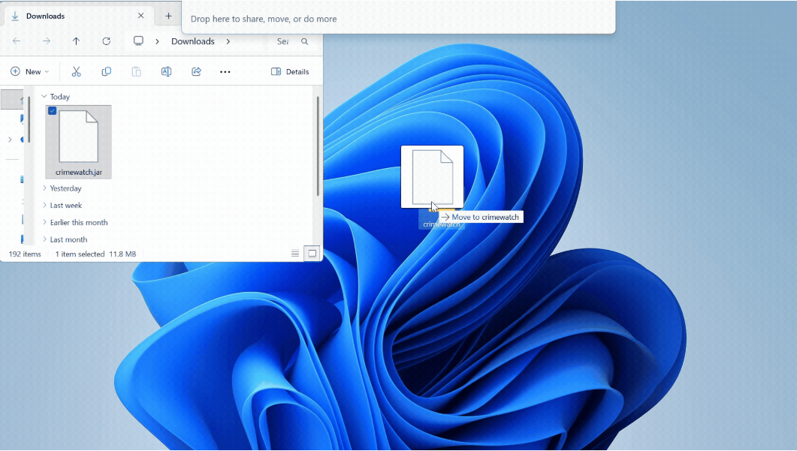
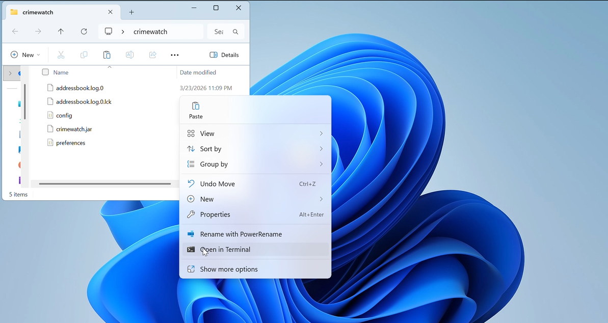
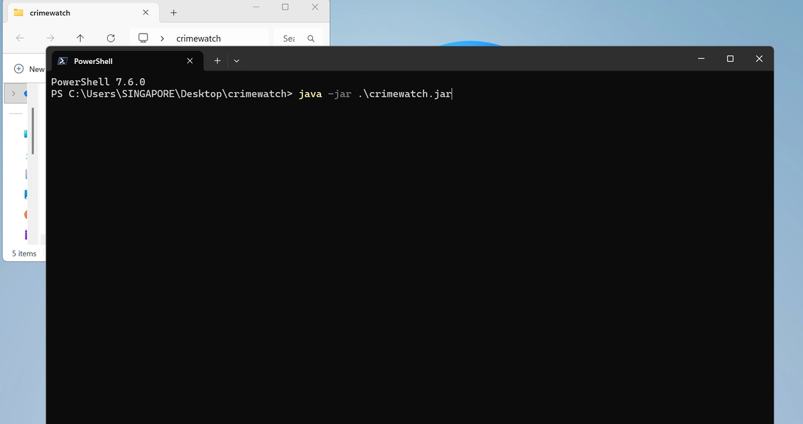

* Table of Contents
{:toc}

<div style="page-break-after: always;"></div>

## What is CrimeWatch?

CrimeWatch is a **desktop contact tracking application** designed specifically for **law enforcement undercover agents and investigators** to manage suspect profiles and investigation encounters. Instead of carrying physical notebooks or risky digital records on your phone, CrimeWatch allows you to securely and efficiently track suspects, their aliases, risk levels, and encounter history by entering typed commands in the app.

### Why CrimeWatch?

Traditional contact apps clutter investigations with unnecessary fields and lack investigation-focused features. CrimeWatch is purpose-built for your workflow, enabling you to store contact details when relevant while prioritizing investigation stages, risk levels, and encounter logging:

- **Suspect-focused tracking**: Manage suspects (not regular contacts) with investigation stages and risk levels
- **Encounter logging**: Record every interaction location, time, and observations for building case evidence
- **Quick, keyboard-driven**: Fast typed-command workflow in a desktop app—no clicking through menus, no distractions
- **Secure data structure**: Stores only investigation-relevant information
- **Bulk reporting**: Export encounter logs by location for case analysis

### Who is this guide for?

This guide is intended for **undercover agents, detective investigators, and law enforcement personnel** who prefer fast, keyboard-driven workflows. You should be comfortable with:
- Basic computer operations (installing software and launching desktop applications)
- Following structured command formats
- Entering typed commands in an application command box

No programming experience is required.

### How to use this guide

- If this is your first time using CrimeWatch, start at [Quick start](#quick-start).
- If you already installed the app, jump to [Features](#features).
- If you need only command syntax, use [Command summary](#command-summary).
- If you are troubleshooting, check [FAQ](#faq) and [Known issues](#known-issues).

### Key Features

CrimeWatch supports the following features: **Add**, **Edit**, and **Delete** contacts; **Log** and **Edit** encounters; **View** contact details; **Set reminders**; **Search** contacts by name, alias, and/or tags (`find`); **Export** to CSV; **Sort** the contact list; and **Protect** sensitive contacts with passwords. See [Command summary](#command-summary) for detailed formats.

## Command summary

| Feature | Command format | Go to |
| --- | --- | --- |
| Add Contact | `add n/NAME p/PHONE e/EMAIL a/ADDRESS s/STAGE [al/ALIAS(,ALIAS...)] [note/NOTES] [r/RISK] [pw/PASSWORD] [t/TAG]...` | [1) Add Contact](#1-add-contact-add) |
| Edit Contact | `edit INDEX [n/NAME] [p/PHONE] [e/EMAIL] [a/ADDRESS] [s/STAGE] [al/ALIAS(,ALIAS...)] [note/NOTES] [r/RISK] [pw/PASSWORD] [t/TAG]...` | [2) Edit Contact](#2-edit-contact-edit) |
| Delete Contact | `delete INDEX [pw/PASSWORD]` | [3) Delete Contact](#3-delete-contact-delete) |
| Log Encounter | `log INDEX d/DATE t/TIME l/LOCATION desc/DESCRIPTION [out/OUTCOME] [pw/PASSWORD]` | [4) Log Encounter](#4-log-encounter-log) |
| Edit Encounter | `editencounter PERSON_INDEX ENCOUNTER_INDEX [d/DATE] [t/TIME] [l/LOCATION] [desc/DESCRIPTION] [out/OUTCOME]` | [5) Edit Encounter](#5-edit-encounter-editencounter) |
| Set Reminder | `remind INDEX d/DATE t/TIME note/NOTE [pw/PASSWORD]` | [6) Set Reminder](#6-set-reminder-remind) |
| View Contact | `view INDEX [pw/PASSWORD]` | [7) View Contact](#7-view-contact-view) |
| Search Contacts | `find [NAME_KEYWORD]... [t/TAG]...` | [8) Search Contacts](#8-search-contacts-find) |
| Sort Contacts | `sort CRITERION` | [9) Sort Contacts](#9-sort-contacts-sort) |
| Export encounters (CSV) | `export l/LOCATION` | [10) Export encounters](#10-export-encounters-to-csv-export) |
| Clear All Data | `clear` | [11) Clear All Data](#11-clear-all-data-clear) |
| Exit Application | `exit` | [12) Exit Application](#12-exit-application-exit) |


--------------------------------------------------------------------------------------------------------------------

## Quick start

1. Ensure Java `17` or above is installed.
  **Mac users:** verify the exact JDK setup [here](https://se-education.org/guides/tutorials/javaInstallationMac.html).

2. Download the latest CrimeWatch `.jar` file from [Releases](https://github.com/AY2526S2-CS2103T-T16-4/tp/releases).

3. Move the `.jar` file into a folder you want to use as your CrimeWatch home folder.
  A new empty folder is recommended.
  

4. Open a terminal in that folder:
  

5. Run the command to launch the app:

   ```bash
   java -jar crimewatch.jar
   ```

   

6. Confirm the app opens and sample data is visible.
   

7. Try this 60-second typed-command tutorial:
   - `help` to open this user guide.
   - `list` to show all contacts.
   - `add n/John Doe p/98765432 e/john@example.com a/Maxwell Road s/surveillance al/JD r/high note/Observed near station` to add a suspect profile.
   - `view 1` to inspect the first contact.
   - `log 1 d/2026-03-31 t/21:15 l/Maxwell Road desc/Short conversation out/Agreed to follow up` to log an encounter.

8. Expected result after Step 7:
   - You should see one newly added contact.
   - You should see one newly added encounter for that contact.

<div markdown="span" class="alert alert-warning">:exclamation: **Operational warning:**
Do not store classified or highly sensitive intelligence in `note/` or `desc/` fields. Data is saved locally and contact passwords are plain text.
</div>

9. Continue with [Features](#features) for full command details.

--------------------------------------------------------------------------------------------------------------------


## Features

<div markdown="block" class="alert alert-info">

**:information_source: Notes about the command format:**<br>

* Words in `UPPER_CASE` are the parameters to be supplied by the user.<br>
  e.g. in `add n/NAME`, `NAME` is a parameter which can be used as `add n/John Doe`.

* Items in square brackets are optional.<br>
  e.g `n/NAME [t/TAG]` can be used as `n/John Doe t/friend` or as `n/John Doe`.

* Items with `…`​ after them can be used multiple times including zero times.<br>
  e.g. `[t/TAG]…​` can be used as ` ` (i.e. 0 times), `t/friend`, `t/friend t/family` etc.

* Parameters can be in any order.<br>
  e.g. if the command specifies `n/NAME p/PHONE_NUMBER`, `p/PHONE_NUMBER n/NAME` is also acceptable.

* Extraneous parameters for commands that do not take in parameters (such as `help`, `list`, `exit` and `clear`) will be ignored.<br>
  e.g. if the command specifies `help 123`, it will be interpreted as `help`.

* If you are using a PDF version of this document, be careful when copying and pasting commands that span multiple lines as space characters surrounding line-breaks may be omitted when copied over to the application.
</div>

<div markdown="span" class="alert alert-info">:bulb: **Tip:**
For fastest field operations, use this command rhythm: `find` -> `view` -> `log` -> `remind`.
</div>

### Viewing help : `help`

Shows a message explaining how to access the help page.

Format: `help`

### 1) Add Contact: `add`

Creates a new suspect profile.

**Format**
`add n/NAME p/PHONE e/EMAIL a/ADDRESS s/STAGE [al/ALIAS(,ALIAS...)] [note/NOTES] [r/RISK] [pw/PASSWORD] [t/TAG]...`

**Parameters**
- `n/NAME` (required): suspect's full name (alphanumeric + spaces, not blank)
- `p/PHONE` (required): phone number (Singapore format, 8 digits, starts with 6/8/9)
- `e/EMAIL` (required): valid email address
- `a/ADDRESS` (required): address (not blank)
- `s/STAGE` (required): one of `surveillance`, `approached`, `cooperating`, `arrested`, `closed`
- `al/ALIAS(,ALIAS...)` (optional): alias list, comma-separated
- `note/NOTES` (optional): notes up to 500 characters, no newlines
- `r/RISK` (optional): one of `low`, `medium`, `high` (default: `medium`)
- `pw/PASSWORD` (optional): sets a contact-level password. Once set, it cannot be changed or removed via commands in the current version. The correct password must be supplied via `pw/CURRENT_PASSWORD` to use `view`, `edit`, `log`, and `remind` on that contact
- `t/TAG` (optional, repeatable): tags

**Examples**
- `add n/John Tan p/98765432 e/johntan@example.com a/311, Clementi Ave 2, #02-25 s/surveillance`
- `add n/Michael Lee p/91234567 e/mlee@example.com a/Marina Bay s/approached al/Big Mike, MLee note/Seen at Marina Bay r/high t/priority`
- `add n/John Doe p/87654321 e/john@example.com a/Maxwell Road s/surveillance pw/password123`

**Validation**
- All required fields must be present
- Repeating single-value prefixes in the same command is not allowed
- Duplicate contacts are not allowed. A contact is considered a duplicate if it has the same name as an existing contact (name matching is **case-insensitive**, e.g. `john tan` and `John Tan` are treated as the same contact)

**Success output**
`New person added: [person details]`

--------------------------------------------------------------------------------------------------------------------

### 2) Edit Contact: `edit`

Updates details of an existing contact without deleting and re-adding the profile.

**Format**
`edit INDEX [n/NAME] [p/PHONE] [e/EMAIL] [a/ADDRESS] [s/STAGE] [al/ALIAS(,ALIAS...)] [note/NOTES] [r/RISK] [pw/PASSWORD] [t/TAG]...`

**Parameters**
- `INDEX` (compulsory): target contact in current list
- At least one prefixed field must be provided (including `pw/` alone when allowed)
- Any omitted field remains unchanged
- **`pw/PASSWORD`:** If the contact **already has** a password, use this to supply the **current** password so the edit is allowed (for example `edit 1 n/NewName pw/oldSecret`). If the contact **does not** have a password, `pw/newpassword` sets a new password.
- `p/PHONE` (optional): Singapore phone number, exactly 8 digits and must start with `6`, `8`, or `9`

**Examples**
- `edit 1 p/91234567 e/johndoe@example.com`
- `edit 2 r/high note/More cooperative in latest meeting`
- `edit 1 pw/newpassword` (only when the contact is not password-protected yet)
- `edit 1 n/UpdatedName pw/oldSecret` (required when the contact already has a password)

**Validation**
- INDEX must exist in the current list.
- Provided fields follow the same validation rules as `add`.
- Repeating non-tag prefixes in the same command is not allowed.
- For `p/PHONE`, only valid Singapore numbers are accepted: exactly 8 digits, starting with `6`, `8`, or `9`.
- If the contact is password-protected, `pw/CURRENT_PASSWORD` is required. Omitting it or supplying the wrong password will result in an error.
- Once a contact has a password, it cannot be changed or removed via `edit` in the current version.

**Success output**
`Edited Person: [person details]`

> **Note:** After a successful `edit` command, the view panel will automatically update to display the edited contact, even if a different contact was previously shown via `view`. To view a different contact again, use the `view` command explicitly.

--------------------------------------------------------------------------------------------------------------------

### 3) Delete Contact: `delete`

Removes a contact permanently, including all associated encounters and reminders.

**Format**
`delete INDEX [pw/PASSWORD]`

**Parameters**
- `INDEX` (compulsory): target contact in current list
- **`pw/PASSWORD` (optional):** if the contact is password-protected, supply the **current** password

**Examples**
- `delete 3`
- `delete 3 pw/oldSecret` (when the contact is password-protected)

**Validation**
- INDEX must exist in the current list.
- If the contact is password-protected, omitting `pw/` causes a password-required error.
- If the contact is password-protected, wrong `pw/` causes an incorrect-password error.
- If the contact is not password-protected, do not supply `pw/`.
- Error: `The person index provided is invalid`

**Success output**
`Deleted Person: [person details]`

--------------------------------------------------------------------------------------------------------------------

### 4) Log Encounter: `log`

Records an interaction with a contact and appends it to the contact’s encounter history.

**Format**
`log INDEX d/DATE t/TIME l/LOCATION desc/DESCRIPTION [out/OUTCOME] [pw/PASSWORD]`

**Parameters**
- `d/DATE` (compulsory): `YYYY-MM-DD`
- `t/TIME` (compulsory): `HH:mm` (24-hour)
- `l/LOCATION` (compulsory): location text
- `desc/DESCRIPTION` (compulsory): what happened (1–500 chars, not blank)
- `out/OUTCOME` (optional): result/follow-up (up to 300 chars)
- **`pw/PASSWORD`:** if the contact is password-protected, supply the **current** password (same as for `edit`, `view`, and `remind`).

**Example**
`log 1 d/2026-02-21 t/18:30 l/Maxwell Road desc/Met at coffee shop out/Agreed to cooperate`

**Example (password-protected contact)**
`log 1 d/2026-02-21 t/18:30 l/Maxwell Road desc/Met at coffee shop pw/oldSecret`

**Validation**
- DATE must be a valid calendar date
  Error: `Invalid date. Use format YYYY-MM-DD.`
- TIME must be valid 24-hour `HH:mm`
  Error: `Invalid time. Use 24-hour format HH:mm.`
- DESCRIPTION cannot be blank; 1–500 characters
- Repeating `d/`, `t/`, `l/`, `desc/`, `out/`, or `pw/` in the same command is not allowed.
- If the contact is password-protected, `pw/CURRENT_PASSWORD` is required or the command will be rejected.
- If the contact is not password-protected, do not supply `pw/`.

**Success output**
`Encounter logged for [Name] on 2026-02-21 18:30.`

--------------------------------------------------------------------------------------------------------------------

### 5) Edit Encounter: `editencounter`

Updates an existing encounter for a contact.

**Format**
`editencounter PERSON_INDEX ENCOUNTER_INDEX [d/DATE] [t/TIME] [l/LOCATION] [desc/DESCRIPTION] [out/OUTCOME]`

**Parameters**
- `PERSON_INDEX` (compulsory): target contact in current list
- `ENCOUNTER_INDEX` (compulsory): target encounter from the viewed encounter cards
- At least one prefixed field must be provided

**Encounter index mapping**
- Encounters shown in `view` are numbered by date/time in descending order (most recent first).
- `ENCOUNTER_INDEX 1` means the encounter currently shown as `#1`.
- Indexes are ordered dynamically based on date/time
- If encounter date/time changes (for example via `editencounter`), indexes may change accordingly.

**Examples**
- `editencounter 1 1 desc/Updated observation notes`
- `editencounter 1 2 d/2026-03-27 t/20:15 l/Tanjong Pagar out/`

**Validation**
- PERSON_INDEX must exist in the current contact list.
- ENCOUNTER_INDEX must exist for that contact.
- Provided fields use the same validation rules as `log`.
- `out/` with an empty value clears outcome.

**Success output**
`Edited encounter #[ENCOUNTER_INDEX] for [Name].`

--------------------------------------------------------------------------------------------------------------------

### 6) Set Reminder: `remind`

Adds a reminder entry to a contact.

**Format**
`remind INDEX d/DATE t/TIME note/NOTE [pw/PASSWORD]`

**Parameters**
- `INDEX` (compulsory): target contact in current list
- `d/DATE` (compulsory): `YYYY-MM-DD`
- `t/TIME` (compulsory): `HH:mm` (24-hour)
- `note/NOTE` (compulsory): reminder text (not blank)
- **`pw/PASSWORD`:** if the contact is password-protected, supply the **current** password (same as for `edit` and `view`).

**Examples**
- `remind 1 d/2026-03-28 t/20:00 note/Meet informant`
- `remind 2 d/2026-04-01 t/09:15 note/Follow up on statement`
- `remind 1 d/2026-03-28 t/20:00 note/Meet informant pw/oldSecret` (when the contact already has a password)

**Validation**
- INDEX must exist in the current contact list.
- DATE must be valid and use `YYYY-MM-DD`.
- TIME must be valid and use 24-hour `HH:mm`.
- NOTE cannot be blank.
- Repeating `d/`, `t/`, `note/`, or `pw/` in the same command is not allowed.
- If the contact is password-protected, `pw/CURRENT_PASSWORD` is required or the command will be rejected.
- If the contact is not password-protected, do not supply `pw/`.

**Success output**
`Reminder set for [Name] on [DATE] [TIME].`

--------------------------------------------------------------------------------------------------------------------

### 7) View Contact: `view`

Displays the full profile of a contact and their encounter cards.

**Format**
`view INDEX [pw/PASSWORD]`

**Password behavior**
- Without password: contact is viewable normally.
- With password: `view` requires the correct `pw/PASSWORD` to display full details.
- `view INDEX` on a protected contact fails with password-required error.
- Password protection applies to the full-profile `view` panel. The contact list (`list`, `find`, sorted list view) remains visible and shows abbreviated fields.
- Passwords are stored in plain text (not production-ready).

**Expected output**
- For unprotected contacts: details are shown immediately.
- For protected contacts with correct password: full details and encounter history are shown.
- For protected contacts without/with wrong password: command fails with a password-related error.

**Output (view panel)**

The view panel displays the following fields in order:
- **Name** — shown as a large heading at the top
- **Stage** — displayed as a coloured badge (e.g. `surveillance`)
- **Risk** — displayed as a coloured badge next to Stage (e.g. `MEDIUM RISK`)
- **Phone**
- **Email**
- **Address**
- **Aliases** — shows `None` if no aliases are set
- **Notes** — shows `None` if no notes are set
- **Tags** — each tag shown as a coloured badge; section omitted if no tags
- **Upcoming Reminders** — shows `No reminders set.` if none exist
- **Encounter History** — shows `No encounters logged.` if none exist; otherwise `#1` is the most recently logged encounter

--------------------------------------------------------------------------------------------------------------------

### 8) Search Contacts: `find`

Filters the contact list by **name or alias keywords** (optional) and/or **tags** (optional). You must supply at least one name keyword or one tag.

**Format**
`find [NAME_KEYWORD]... [t/TAG]...`

**Examples**
- `find john`
- `find mike marina` — matches if **any** name or alias keyword matches (see below).
- `find t/suspect t/wanted` — matches contacts that have **any** of these tags.
- `find alice t/suspect` — matches only if the contact satisfies **both**: name criteria **and** tag criteria (not either alone).

**Behavior**
- **Name keywords** (text before any `t/`): case-insensitive; each keyword must match a **whole word** in the contact’s **name or aliases**. If you give several name keywords, a contact matches if **any** of those words appears in the name or aliases.
- **Tags**: use `t/TAG` (alphanumeric tag names only). You can repeat `t/` for multiple tags; a contact matches if it has **any** of the listed tags.
- **Name + tags in the same command**: the contact must match the **name** part **and** the **tag** part together (**AND**), not one or the other.
- Notes are **not** searched by `find`.
- Result count is shown as `X persons listed!` (including `0 persons listed!` when nothing matches).

--------------------------------------------------------------------------------------------------------------------

### 9) Sort Contacts: `sort`

Sorts the currently displayed contact list by a chosen criterion.

**Format**
`sort CRITERION`

**Allowed criteria** (case-insensitive)
- `location`
- `tag`
- `alphabetical`
- `status`
- `recent`

**Examples**
- `sort location`
- `sort tag`
- `sort alphabetical`
- `sort status`
- `sort recent`

**Behavior**
- Sorting is applied to the displayed list view.
- `sort location`: uses the location from each contact's chronologically latest encounter (maximum encounter date-time); contacts without encounters appear last.
- `sort tag`: uses each contact's alphabetically smallest tag; contacts without tags appear last.
- `sort alphabetical`: sorts by contact name (A-Z).
- `sort status`: sorts by stage/status alphabetically.
- `sort recent`: sorts by each contact's chronologically latest encounter date-time first (most recent by date-time).
- Ties are resolved by contact name in alphabetical order.

--------------------------------------------------------------------------------------------------------------------

### 10) Export encounters to CSV: `export`

Exports all encounters whose **location** matches the value you give, to a UTF-8 CSV file. Rows are sorted by encounter date-time (earliest first).

**Format**
`export l/LOCATION`

**Parameters**
- `l/LOCATION` (compulsory): must match encounter locations the same way as stored (see **Behavior**).

**Example**
`export l/Harbor District`

**Behavior**
- Matching is **case-insensitive**. Leading and trailing spaces on your input and on each stored encounter location are ignored; the trimmed strings must be equal.
- The file is written under the app home directory to `exports/CrimeWatch-export-<timestamp>.csv`, where `<timestamp>` is in `yyyyMMdd-HHmmss` form (local time when the command runs).
- CSV columns (header row): `encounterTimestamp`, `encounterDescription`, `encounterOutcome`, `contactName`, `contactTags`. Tags for a contact are comma-separated and sorted alphabetically. Fields are quoted and follow standard CSV escaping for double quotes.

**Outcomes**
- **Success:** `Exported N matching encounters to exports/CrimeWatch-export-<timestamp>.csv.` (with the actual path shown).
- **No matching encounters:** the command fails with `No encounters found at location <your location>.` — **no file** is created.
- **Invalid format** (e.g. missing `l/`, wrong shape): invalid command format message referencing `export` usage.
- **Blank location** (after trim): `Encounter location can take any value, and should not be blank`
- **Write error** (e.g. cannot create `exports/`): `Failed to export to <path>: <reason>`

--------------------------------------------------------------------------------------------------------------------

### 11) List All Contacts: `list`

Resets any active `find` filter and displays all contacts in the default order. Also closes any open contact profile in the side panel.
Password protection does not hide entries in this list; it only gates full-profile access via `view`.

**Format**
`list`

**When to use**
- After a `find` command, to return to the full contact list
- To close a currently open contact profile without opening another

**Success output**
`Listed all persons`

--------------------------------------------------------------------------------------------------------------------

### 12) Clear All Data: `clear`

Clears all entries from CrimeWatch.

Format: `clear`

### 13) Exit Application: `exit`

Exits the program.

Format: `exit`

### Saving the data

CrimeWatch data are saved in the hard disk automatically after any command that changes the data. There is no need to save manually.

### Editing the data file

CrimeWatch data are saved automatically as a JSON file `[JAR file location]/data/crimewatch.json`. Advanced users are welcome to update data directly by editing that data file.

<div markdown="span" class="alert alert-warning">:exclamation: **Caution:**
If your changes to the data file make its format invalid, CrimeWatch will discard all data and start with an empty data file at the next run. Hence, it is recommended to back up the file before editing it.<br>
Furthermore, certain edits can cause CrimeWatch to behave in unexpected ways (e.g., if a value entered is outside acceptable ranges). Edit the data file only if you are confident that you can update it correctly.
</div>

### Archiving data files `[coming in v1.6]`

_Details coming soon ..._

--------------------------------------------------------------------------------------------------------------------

<div style="page-break-after: always;"></div>

## FAQ

**Q: How do I transfer my data to another computer?**<br>
**A**: Install the app on the other computer and overwrite the empty data file it creates with the `crimewatch.json` file from your previous CrimeWatch home folder.

**Q: Can I edit suspect records after adding them?**<br>
**A**: Yes, use the `edit` command to update any field—name, aliases, stage, risk level, or notes. Existing encounters are preserved.

**Q: What happens if I delete a suspect profile?**<br>
**A**: All associated encounters and reminders are permanently deleted as well. Make sure you export encounter logs to CSV first if you need to retain that data.

**Q: How do I export encounter data for analysis?**<br>
**A**: Use the `export l/LOCATION` command to export all encounters at a specific location to a CSV file. The file is saved in the `exports/` folder under your app home directory.

**Q: What if I need to modify an encounter record I logged earlier?**<br>
**A**: Use the `editencounter` command with the person index and encounter index. Type `view INDEX` first to see all encounters for that suspect, then identify which encounter to edit.

**Q: How do I search for a suspect if I only remember part of their name, alias, or a tag?**<br>
**A**: Use `find` with name keywords and/or `t/TAG`. Name matching is case-insensitive by **whole word** in the contact’s **name or aliases** (notes are not searched). Example: `find mike` or `find t/highrisk`. To require both a name and a tag, combine them, e.g. `find alex t/suspect` (**and**, not or).

**Q: Can I track the same suspect across multiple investigation stages?**<br>
**A**: Yes. Use the `edit` command to update the `s/STAGE` field as the investigation progresses (e.g., from `surveillance` to `arrested` to `closed`).

**Q: My command is giving an error even though it looks correct. What should I check?**<br>
**A**: 1) Ensure you're not repeating prefixes (e.g., `n/... n/...` is invalid). 2) Check date/time formats are exactly `YYYY-MM-DD` and `HH:mm`. 3) Verify the index exists in the current contact list. 4) If copying from a PDF, manually retype the command to avoid hidden space issues.

<div style="page-break-after: always;"></div>

**Q: What if `addressbook.json` is corrupted or cannot be read?**<br>
**A**: CrimeWatch shows an error when the app opens. Only the `exit` command is accepted until you repair or replace the file; other commands are blocked and your data file is not overwritten. Use `exit`, fix `addressbook.json` (e.g. from a backup), then restart.

--------------------------------------------------------------------------------------------------------------------

## Known issues

1. **When using multiple screens**, if you move the application to a secondary screen, and later switch to using only the primary screen, the GUI will open off-screen. The remedy is to delete the `preferences.json` file created by the application before running the application again.
2. **If you minimize the Help Window** and then run the `help` command (or use the `Help` menu, or the keyboard shortcut `F1`) again, the original Help Window will remain minimized, and no new Help Window will appear. The remedy is to manually restore the minimized Help Window.
3. **Command output can exceed the default window size**, especially for long validation errors (e.g., malformed `find` usage). This may require both horizontal and vertical scrolling in the result area. The remedy is to widen the app window when reading long outputs.
4. **At minimum window size, full profile content may be obscured after `view INDEX`**. In some cases, not all profile details are visible/scrollable unless the window is widened. The remedy is to increase the window width or height before reviewing full profile details.
5. **Duplicate names are currently not allowed in `add`/`edit`**. Editing a contact’s name to another existing name can produce `This person already exists in CrimeWatch.` even when they are different people. The workaround is to keep names distinct (for example by adding an identifier in the name) and use aliases/tags for disambiguation.

--------------------------------------------------------------------------------------------------------------------
